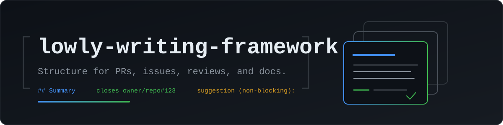

# lowly-writing-framework

An [Agent Skill](https://agentskills.io/) that gives a coding agent the structural rules for developer writing: PR and issue bodies, review comments, docs, code comments, and requirements. It decides what an artifact contains and where each piece sits. It has no opinion on how the sentences sound; a separately installed voice-pack skill can supply that.

This README follows [Diátaxis](https://diataxis.fr/), so each top-level section answers one kind of question: learning, doing, looking up, understanding.

## Contents

- [Tutorial](#tutorial)
  - [Install](#install)
  - [First walk: draft a PR body](#first-walk-draft-a-pr-body)
- [How-to guides](#how-to-guides)
  - [Pair with a voice-pack skill](#pair-with-a-voice-pack-skill)
  - [Update](#update)
  - [Run the mechanical self-check by hand](#run-the-mechanical-self-check-by-hand)
  - [Write an EARS requirement](#write-an-ears-requirement)
  - [Write a Conventional Comments review](#write-a-conventional-comments-review)
- [Reference](#reference)
  - [File map](#file-map)
- [Explanation](#explanation)
  - [Why split framework from voice](#why-split-framework-from-voice)
  - [The frameworks it enforces](#the-frameworks-it-enforces)

# Tutorial

## Install

The skill installs with the [Skills CLI](https://github.com/vercel-labs/skills):

```sh
npx skills add lowlysre/lowly-writing-framework -g
```

`-g` installs into your user directory so the skill loads in every project. Drop it to install into the current project only.

## First walk: draft a PR body

1. Make a small code change on a branch in any repo with a remote on GitHub.
2. Ask your agent: "open a draft PR for this branch."
3. Watch the skill activate before the PR call. The `description` frontmatter names `create_pull_request` as a trigger, and `SKILL.md` routes the agent to `references/pr-writing.md` before it drafts.
4. The body fills the repo's PR template, or the skill's fallback of a `## Summary` heading over 1-3 sentences on why the change exists, then what changed.
5. The body carries a closing reference in the full `owner/repo#123` form. If no issue exists yet, the skill has the agent file one scoped to the change first, per `references/pr-writing.md`.
6. A `## Testing` section states what ran and what didn't. An untested path stays visible as an unchecked box or a `> [!WARNING]` admonition.
7. Before the PR call, the skill has the agent write the body to a temp file and run the mechanical checks from `references/self-check.md` against it. A bare `#123`, a backticked issue reference, a `Part of` phrasing, or a missing `<!--:robot:-->` watermark fails the check and gets fixed before anything reaches GitHub.

# How-to guides

## Pair with a voice-pack skill

"Voice pack" isn't a term from the Agent Skills spec or a wider convention, it's this repo's own name for a separately installed Agent Skill that governs tone, punctuation, and phrasing for the same artifacts this skill structures: PR and issue bodies, review comments, docs, code comments. This skill decides what goes where; the voice pack decides how it reads. Neither skill names the other.

The Agent Skills spec has no dependency or `extends` mechanism, so an agent matches a request against every installed skill's `description` and loads whichever fit. Pairing two skills means making both `description` fields match the same requests, nothing more.

To install an existing voice pack:

1. Install it the same way as this skill: `npx skills add <owner>/<voice-pack-repo> -g`.
2. Open its `SKILL.md` and confirm its `description` lists the same artifacts and tool calls as this repo's (PR body, issue body, review comment, doc prose, code comment, requirement, and `create_pull_request` through `reply_and_resolve_review_thread`). If it doesn't, a request that triggers this skill may not trigger the voice pack, or vice versa.
3. Ask your agent to draft something covered by both (a PR body is the easiest test) and confirm the output reads in the voice pack's style while still following this skill's structure (template filled, closing reference present, watermark at the end).

To write your own voice pack:

1. Scaffold a new skill directory with its own `SKILL.md`.
2. Copy this repo's `description` line into it verbatim, then edit only the sentence after "BLOCKING REQUIREMENT" if your voice pack narrows the artifact list. Keep the artifact and tool-call lists identical to this skill's, or the two won't co-activate.
3. Fill the body with tone, punctuation, and phrasing rules only. Don't restate anything from this skill's Scope section (body structure, issue-closing rules, EARS, Conventional Comments labels, present tense) or it'll fight this skill's rules instead of layering on top.
4. Whenever this repo's `description` line changes, update your copy to match.

## Update

```sh
npx skills update lowly-writing-framework
```

The CLI deletes and recreates the skill directory on update, so don't keep local edits inside it. Fork the repo instead.

## Run the mechanical self-check by hand

Write the artifact to a file, then run the checks from `references/self-check.md`. On Linux or macOS:

```sh
grep -inE '(removed|used to|previously|no longer|was updated|a scan found|as of #)' body.md
grep -nE '(^|[^a-zA-Z0-9_./-])#[0-9]+' body.md
grep -nE '`#[0-9]+|#[0-9]+`' body.md
grep -inE '(part of|relate[sd]? to).*#[0-9]+' body.md
grep -nP '(?<!\]\()https?://' body.md
grep -c '<!--:robot:-->$' body.md
```

On Windows PowerShell, `Select-String` takes the same patterns; the file lists both forms per check. Zero hits on every check (and exactly one on the watermark count) means the mechanical pass is clean. The judgment checks in the same file still need a read.

## Write an EARS requirement

Full syntax, the five patterns, and document vs. inline mode live in `references/requirements-ears.md`. The short version: one sentence, one `SHALL`, one observable trigger; `should` and `may` mean it isn't a requirement yet.

## Write a Conventional Comments review

Full label list and decoration rules live in `references/review-comments.md`. The short version: open every comment with a plain-text label (`praise:`, `issue:`, `suggestion:`, and the rest), one comment per point, `<!--:robot:-->` on its own line at the end.

# Reference

## File map

- `SKILL.md`: always-loaded entry point; scope, formatting mechanics, never-trim list, boundaries, workflow triggers, structural anti-patterns, and the routing table below
- `references/body-writing.md`: body structure shared by PR and issue bodies (fill the template, why over how, Context section, 3-paragraph and 3,000-character ceilings, `Bonus` split, mermaid diagrams)
- `references/pr-writing.md`: PR titles, issue-closing rules, `## Testing` honesty, `## Pre-merge`/`## Post-merge` sections, AI watermark
- `references/issue-writing.md`: issue titles, template selection, YAML form rendering, related-work references
- `references/review-comments.md`: Conventional Comments labels and decorations for reviewing someone else's PR
- `references/docs-and-comments.md`: present-tense rule for README, doc, and code-comment prose; when an issue number belongs in a comment
- `references/requirements-ears.md`: the five EARS patterns, document mode vs. inline mode, requirement self-check
- `references/self-check.md`: mechanical checks (run the command) and judgment checks (read the text) for every finished artifact
- `references/banned-phrases.md`: AI-era phrases to cut, grouped by failure mode
- `references/meat-proxy-mode.md`: extra rules for artifacts a human signs but another AI executes
- `references/gh-cli.md`: fetch-before-edit, `--body-file`, `-f` vs `-F`, length gating, re-fetch-to-verify
- `assets/hero.svg`: the README banner; `assets/hero-og.svg` and `assets/hero-og.png` are the 1200x630 social-preview variant for the repo's Open Graph image

# Explanation

## Why split framework from voice

Two facts about Agent Skills force the split. First, the spec has no `extends` or `depends` field, so one skill can't declare that it builds on another. Second, `npx skills update` deletes and recreates the skill directory, so a personalization subfolder inside a single skill is wiped on every update. A voice layer either lives in a fork that diverges from upstream or in a separate skill.

Separate skills are the only clean composition. Both skills list the same triggers, an agent that loads every matching skill loads both, and each governs a different axis of the same artifact: this one decides what goes where, the voice pack decides how it reads. The scope section in `SKILL.md` and the rule in `AGENTS.md` about not adding taste rules here exist to keep that boundary from drifting.

## The frameworks it enforces

- [EARS](https://ieeexplore.ieee.org/document/5211796) (Easy Approach to Requirements Syntax, Mavin et al., IEEE RE 2009) constrains every requirement to one of five testable sentence patterns. Mavin's own summary on [alistairmavin.com](https://alistairmavin.com/ears/): "The Easy Approach to Requirements Syntax (EARS) is a mechanism to gently constrain textual requirements"
- [Conventional Comments](https://conventionalcomments.org/) labels every review comment so the author knows at a glance what's blocking and what isn't. From the spec: "Adhering to a consistent format improves reader's expectations and machine readability"
- [Diátaxis](https://diataxis.fr/) organizes documentation into four quadrants by the reader's need: tutorials, how-to guides, reference, explanation. This README uses it, and `references/docs-and-comments.md` inherits its present-tense, describe-the-system-as-it-is stance
