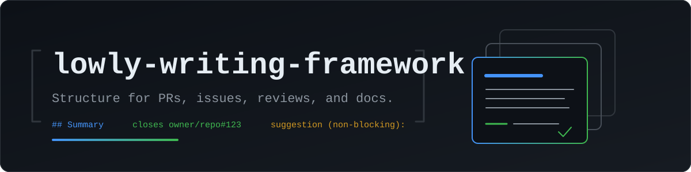

# lowly-writing-framework

<!-- token-badges:start -->
[](#token-budget) [](#token-budget) [](#token-budget)
<!-- token-badges:end -->

An [Agent Skill](https://agentskills.io/) that gives a coding agent the structural rules for developer writing: PR and issue bodies, review comments, docs, code comments, and requirements. It decides what an artifact contains and where each piece sits.

## Contents

- [What you get](#what-you-get)
- [Install and update](#install-and-update)
- [Layout](#layout)
- [Token budget](#token-budget)
- [Versioning](#versioning)
- [Further docs](#further-docs)

## What you get

A template gives a PR its headings. It can't make what sits under them worth reading, so this skill leaves your templates alone and works on the part they can't:

- **Substance first.** Every artifact opens with why it exists, then the least a reader needs to act. Breaking changes, risks, and migration steps are never trimmed, whatever the length target
- **Claims you can trust.** A `## Testing` section names what CI doesn't cover and flags the real gaps. Closing keywords are verified against the API instead of assumed to have linked
- **Reviews with a clear ask.** Conventional Comments labels say what blocks and what doesn't, and few-line fixes ship as one-click suggested edits
- **GitHub mechanics that hold.** Issue references that autolink, permalinks that expand into code previews, and Mermaid diagrams that avoid the constructs GitHub fails to render
- **Checks, not vibes.** A closing pass of greps catches the slips proofreading misses, and a `gh` guide covers posting without mangling the text
- **Your conventions, kept.** Your template, title style, labels, and commit format win, and tone belongs to a separately installed voice-pack skill. The rules constrain structure and honesty, so different repos get different-looking artifacts with the same bones

Same change, no PR template in the repo:

```markdown
Updated config.py, client.py, and test_client.py. Changed the timeout. All tests pass.
```

```markdown
Raises the default HTTP timeout from 5s to 30s, fixing acme/sdk#77.

## Why
Slow regions hit the 5s limit and surfaced as `ReadTimeout`. The default lives in `sdk/config.py` because `sdk/generated/client.py` is regenerated on every release.

## Testing
CI runs the existing unit suite on every push; no manual steps.

<!--:robot:-->
```

The skill governs the writing, never the change: the diff, the commit history, and the scope stay yours. AI-authored PR bodies and review comments carry a `<!--:robot:-->` watermark. Pairing with a voice pack is covered in [docs/how-to.md](docs/how-to.md#pair-with-a-voice-pack-skill), and why the two are separate skills in [docs/explanation.md](docs/explanation.md).

A voice pack co-activates only when its `description` frontmatter lists the same artifacts and tool calls as this skill's, so a change to that `description` is a breaking release; see [Versioning](#versioning).

## Install and update

The skill installs with the [Skills CLI](https://github.com/vercel-labs/skills):

```sh
npx skills add lowlysre/lowly-writing-framework -g
```

`-g` installs into your user directory so the skill loads in every project. Drop it to install into the current project only.

To update:

```sh
npx skills update lowly-writing-framework
```

The CLI deletes and recreates the skill directory on update, so don't keep local edits inside it. Fork the repo instead.

### Plugin with an activation reminder

[lowly-writing-framework-plugin](https://github.com/lowlysre/lowly-writing-framework-plugin) bundles this skill and adds a hook that reminds the agent to load it before a GitHub write. It targets Claude Code, Copilot CLI, and Codex CLI. Install the plugin or the skill, not both, or the agent sees the skill twice.

## Layout

`SKILL.md` is the always-loaded entry point: scope, formatting mechanics, the never-trim list, and a routing table that sends the agent to one or two files under `references/` on demand. [AGENTS.md](AGENTS.md) describes each file. Evaluation scenarios live under `evals/`, one JSON file per scenario, and the tutorial, how-to guides, and explanation live under `docs/`.

## Token budget

The badges at the top follow the three loading tiers in the [Agent Skills spec](https://agentskills.io/specification#progressive-disclosure), which recommends "< 5000 tokens" for the `SKILL.md` body:

<!-- token-table:start -->
| Tier | What loads | Tokens |
|---|---|---|
| Always loaded | `SKILL.md` frontmatter (`name`, `description`) | ~120 |
| On activation | `SKILL.md` body | ~2,800 |
| On demand | Every file under `references/` | ~21,600 |
<!-- token-table:end -->

The on-demand figure is a ceiling. `SKILL.md` routes each artifact to one or two reference files, so a typical activation reads a small slice of it.

Counts use the `o200k_base` encoding from [gpt-tokenizer](https://github.com/niieani/gpt-tokenizer). Claude's tokenizer isn't public, so treat them as estimates. The badges are static shields.io images; `npm run tokens` rewrites them and this table between their comment markers, per the Workflow section in `AGENTS.md`.

## Versioning

Tagged with git tags in semver form (`v1.0.0`). A change to `SKILL.md`'s `description` frontmatter is a major/breaking release: it's the line a voice-pack skill copies verbatim to co-activate, so a diff there means every voice pack needs to update its own copy to keep matching. A structural rule change inside `SKILL.md`'s body or any `references/*.md` file is minor or patch, it doesn't require a voice pack to change anything.

## Further docs

The docs under `docs/` follow [Diátaxis](https://diataxis.fr/), one file per kind of question:

- Learning: [docs/tutorial.md](docs/tutorial.md) walks through drafting a first PR body
- Doing: [docs/how-to.md](docs/how-to.md) pairs a voice pack, runs the self-check by hand, and starts an EARS requirement or a Conventional Comments review
- Understanding: [docs/explanation.md](docs/explanation.md) explains the framework/voice split and the frameworks the rules enforce
