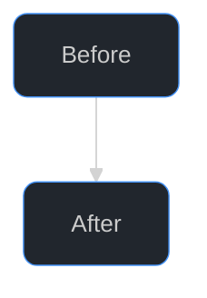
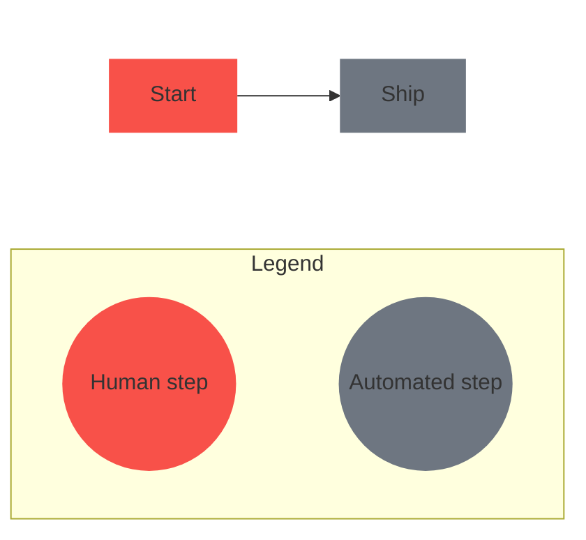

# Mermaid diagrams in PR/issue bodies and docs

Loaded from `SKILL.md` whenever a diagram is going into a PR body, issue body, or doc. Everything here is GitHub-rendering mechanics for Mermaid, not body structure, see `references/body-writing.md` for where a diagram fits inside a body.

## When to use one

Use mermaid when a picture genuinely helps the reader, the mechanics of a change or the wider system context, or a bug's reproduction flow in an issue. Skip for trivial items. One or two inline, each with a one-line lead-in; more than two go in a collapsible section. Favor `flowchart`/`sequenceDiagram`, short node labels. A diagram of the old vs new flow beats prose describing both.

## Theme and styling

GitHub's markdown renderer strips custom CSS from PR and issue bodies, but a `%%{init: ...}%%` directive still forces a consistent dark theme, sets node padding, and rounds node corners on both GitHub and the Copilot app, so open every flowchart with this combination for a less-default look:



Don't drop `padding` below 14: wide multi-line `<br/>` labels combined with the rounded corners above crowd the border at 8px and below, especially on the widest line of a stacked label.

Don't define a node inline with a `:::` class shorthand as the target of a dotted edge: `A -.-> T[Target]:::risk` fails on GitHub with "Unable to render rich display" even though mermaid 11 parses it fine locally. Declare the node first (`T[Target]:::risk`), then draw the edge with the bare id (`A -.-> T`).

`theme: dark` forces box contrast to hold regardless of the viewer's own GitHub light/dark mode setting, and `nodeBorder` matches GitHub's own accent blue (the same one used for usernames and links). Skip fighting for per-link arrowhead colors, Mermaid arrowheads always inherit the line's color with no themeVariable or linkStyle to set them separately. Skip `font-weight` too, GitHub's font stack only has regular/bold weight files, so any numeric value in between snaps to one or the other rather than landing on a true medium weight.

## Legends for color-coded diagrams

GitHub's Mermaid renderer has no built-in legend support ([mermaid-js/mermaid#2110](https://github.com/mermaid-js/mermaid/issues/2110) is still open). Once a diagram uses `style`/`classDef` fills to distinguish categories, a legend is what tells the reader what each color means instead of leaving them to guess or hunt for a caption. Build one as a titled subgraph of same-size swatch nodes, forced below the diagram it explains, joined by invisible links (`~~~`) so they lay out in a row instead of stacking:



Three details make this render right instead of subtly wrong on GitHub, plus one optional polish:

- **Give the subgraph a real title.** `subgraph Legend["Legend"]`, not `subgraph Legend[ ]`, GitHub renders the bracketed text as the subgraph's own heading, an empty one leaves the legend box unlabeled.
- **Force every swatch to the same size.** A circle node (`((...))`) sizes itself to fit its own label, so "Human step" renders visibly smaller than "Automated step" sitting right next to it. Wrap each label in a fixed-width `<p style='width:7rem;margin:0px;'>` so every swatch sizes to the same box regardless of text length, and pick one width wide enough for the longest label in that legend.
- **Force the legend below the diagram, not floating above it.** A `Legend` subgraph with no edges into the main flow is a disconnected component, and Mermaid's layout engine renders those above the flow, not after it, regardless of source order. Wrap the diagram's real content in its own `subgraph Main[ ]`, hide that wrapper's box with `style Main fill:none,stroke:none`, give it `direction LR` to preserve the flow's original left-to-right layout, switch the outer graph to `flowchart TB`, and connect the two subgraphs with an invisible link declared last (`Main ~~~ Legend`). The outer `TB` direction stacks `Main` above `Legend`; nothing about the diagram's own internal layout changes.
- **Scale it down, optionally.** A full-size legend competes visually with the diagram it's explaining. Give the swatches their own `classDef`s, `legHuman`/`legAutomated` here, distinct from the main flow's `human`/`automated`, reusing those class names on the legend nodes would shrink the main flow's own nodes too, since `:::human` on a legend node and a main-flow node both resolve to the same class. Add a smaller `font-size` to the legend-only classes and widen the label's fixed width enough that it doesn't truncate at that size:

```mermaid
classDef legHuman fill:#f85149,stroke-width:0px,font-size:9px
classDef legAutomated fill:#6e7681,stroke-width:0px,font-size:9px
```

  and bump the `<p style='width:...'>` from the snippet above to `width:4.5rem` at that font size, `7rem` is sized for the default 16px font and truncates a label like "Automated step" once it's shrunk.

Keep legend labels to one or two words, matching the category name a reader would already infer from context, not a restatement of the whole diagram.

## Verifying a diagram actually renders right on GitHub

A diagram that looks right in an editor's live preview, a CLI's chat preview, or a third-party renderer isn't proof it renders right on GitHub itself: every one of those is a different Mermaid build from the one GitHub ships, and a fragile pattern (nested subgraphs, a cluster-to-cluster invisible link, an HTML label forcing node size) is exactly where those builds diverge. GitHub renders Mermaid inside its own sandboxed `viewscreen.githubusercontent.com` iframe, a live PR/issue preview or comment is the only render that reflects what a reader will actually see.

Before shipping a diagram that leans on one of the fragile patterns above, paste it into a scratch gist (`gh gist create scratch.md`, secret by default, don't add `--public`, the diagram's node labels can name internal systems or infra) and open it, that renders through the same GitHub pipeline a PR or issue body uses. Delete the gist once it's confirmed. A plain flowchart with no nested subgraphs or invisible links doesn't need this, the fragility is specific to the layout tricks, not to Mermaid diagrams generally.
