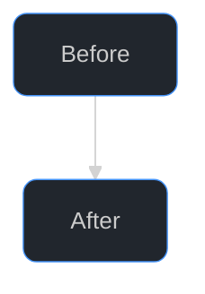

# Mermaid diagrams in PR/issue bodies and docs

Loaded from `SKILL.md` whenever a diagram is going into a PR body, issue body, or doc. Everything here is GitHub-rendering mechanics for Mermaid, not body structure, see `references/body-writing.md` for where a diagram fits inside a body.

## When to use one

Use mermaid when a picture genuinely helps the reader, the mechanics of a change or the wider system context, or a bug's reproduction flow in an issue. Skip for trivial items. One or two inline, each with a one-line lead-in; more than two go in a collapsible section. Favor `flowchart`/`sequenceDiagram`, short node labels. A diagram of the old vs new flow beats prose describing both.

## Theme and styling

GitHub's markdown renderer strips custom CSS from PR and issue bodies, but a `%%{init: ...}%%` directive still forces a consistent dark theme, sets node padding, and rounds node corners on both GitHub and the Copilot app, so open every flowchart with this combination for a less-default look:



Don't drop `padding` below 14: wide multi-line `<br/>` labels combined with the rounded corners above crowd the border at 8px and below, especially on the widest line of a stacked label.

Don't define a node inline with a `:::` class shorthand as the target of a dotted edge: `A -.-> T[Target]:::risk` fails on GitHub with "Unable to render rich display" even though mermaid 11 parses it fine locally. Declare the node first (`T[Target]:::risk`), then draw the edge with the bare id (`A -.-> T`).

`theme: dark` forces box contrast to hold regardless of the viewer's own GitHub light/dark mode setting, and `nodeBorder` matches GitHub's own accent blue (the same one used for usernames and links). Skip fighting for per-link arrowhead colors, Mermaid arrowheads always inherit the line's color with no themeVariable or linkStyle to set them separately. Skip `font-weight` too, GitHub's font stack only has regular/bold weight files, so any numeric value in between snaps to one or the other rather than landing on a true medium weight.

## Legends for color-coded diagrams

GitHub's Mermaid renderer has no built-in legend support ([mermaid-js/mermaid#2110](https://github.com/mermaid-js/mermaid/issues/2110) is still open). Once a diagram uses `style`/`classDef` fills to distinguish categories, a legend is what tells the reader what each color means instead of leaving them to guess or hunt for a caption. Build one with a dedicated subgraph: one node per category, joined by invisible links (`~~~`) so they lay out in a row instead of stacking, each node styled with the same fill used on its category elsewhere in the diagram and `stroke-width:0px` so it reads as a swatch, not a decision box:

```mermaid
subgraph Legend[ ]
    direction LR
    human(("Human step")):::human
    auto(("Automated step")):::automated
    human ~~~ auto
end
classDef human fill:#f85149,stroke-width:0px
classDef automated fill:#6e7681,stroke-width:0px
```

Keep legend labels to one or two words, matching the category name a reader would already infer from context, not a restatement of the whole diagram. Place the `Legend` subgraph last in the diagram source so it renders as a trailing row, not interleaved with the flow it's explaining.
