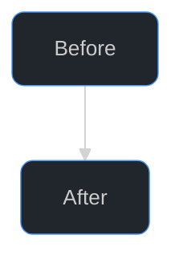
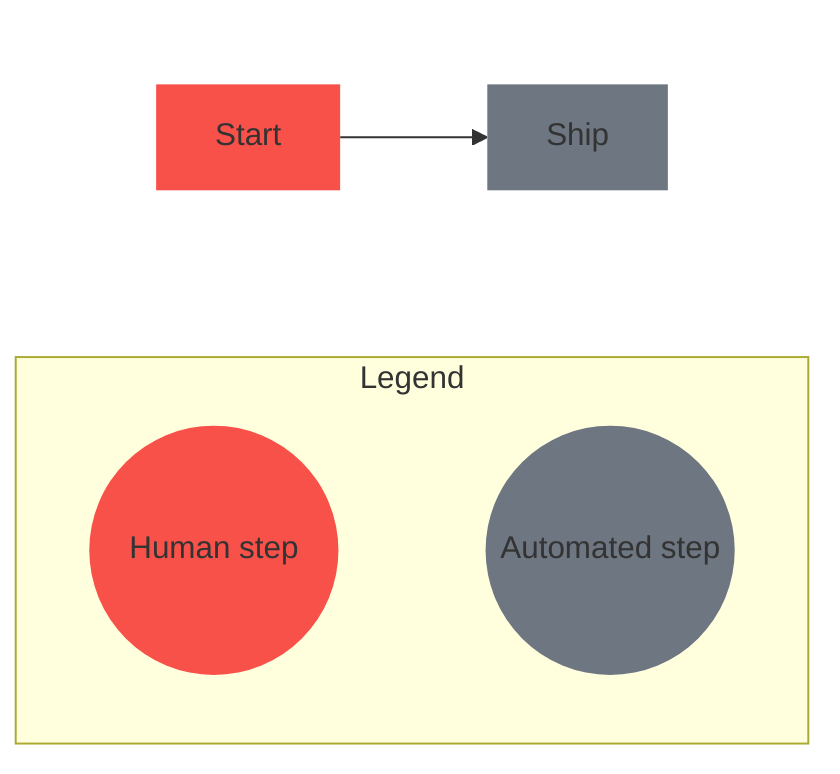

# Mermaid diagrams in PR/issue bodies and docs

Loaded from `SKILL.md` whenever a diagram is going into a PR body, issue body, or doc. Everything here is GitHub-rendering mechanics for Mermaid, not body structure, see `references/body-writing.md` for where a diagram fits inside a body.

## When to use one

Use mermaid when a picture helps the reader: a change's mechanics, the wider system context, or a bug's reproduction flow. Skip for trivial items. One or two inline, each with a one-line lead-in; more than two go in a collapsible section. Favor `flowchart`/`sequenceDiagram`, short node labels. A diagram of the old vs new flow beats prose describing both.

## Theme and styling

GitHub strips custom CSS from PR and issue bodies, but a `%%{init: ...}%%` directive still sets a dark theme, node padding, and rounded corners on both GitHub and the Copilot app. Open every flowchart with this combination:

```mermaid
%%{init: {"theme": "dark", "flowchart": {"padding": 14}, "themeVariables": {"fontSize": "14px", "mainBkg": "#21262d", "nodeBorder": "#4493f8"}}}%%
flowchart TD
    classDef default rx:8,ry:8,stroke-width:0.75px
    A[Before] --> B[After]
```

Don't drop `padding` below 14: wide multi-line ` ` labels crowd the rounded border at 8px and below.

Don't define a node inline with a `:::` class shorthand as the target of a dotted edge: `A -.-> T[Target]:::risk` fails on GitHub with "Unable to render rich display" though mermaid 11 parses it locally. Declare the node first (`T[Target]:::risk`), then draw the edge with the bare id (`A -.-> T`).

Don't point an edge at a subgraph's own id: `consumers --> Backend` fails on GitHub with "Unable to render rich display" when `Backend` is `subgraph Backend[...]`, though mermaid.live renders it. GitHub's build only allows a real node as an edge endpoint, so use `consumers --> ingest` where `ingest` is a node inside the subgraph.

`theme: dark` holds box contrast in either GitHub light/dark mode, and `nodeBorder` matches GitHub's accent blue. Skip per-link arrowhead colors, arrowheads always inherit the line's color. Skip `font-weight` too, GitHub's fonts only ship regular and bold, so in-between values snap to one of them.

## Legends for color-coded diagrams

Mermaid has no built-in legend support ([mermaid-js/mermaid#2110](https://github.com/mermaid-js/mermaid/issues/2110) is still open). Once `style`/`classDef` fills distinguish categories, add a legend so the reader doesn't have to guess what each color means. Build one as a titled subgraph of same-size swatch nodes, forced below the diagram it explains, joined by invisible links (`~~~`) so they lay out in a row instead of stacking:

```mermaid
flowchart TB
    subgraph Main[ ]
        direction LR
        A["Start"]:::human --> B["Ship"]:::automated
    end
    style Main fill:none,stroke:none

    subgraph Legend["Legend"]
        direction LR
        human(("<p style='width:7rem;margin:0px;'>Human step</p>")):::human
        auto(("<p style='width:7rem;margin:0px;'>Automated step</p>")):::automated
        human ~~~ auto
    end
    classDef human fill:#f85149,stroke-width:0px
    classDef automated fill:#6e7681,stroke-width:0px

    Main ~~~ Legend
```

Three details make it render right on GitHub, plus one optional polish:

- **Give the subgraph a real title.** `subgraph Legend["Legend"]`, not `subgraph Legend[ ]`: GitHub renders the bracketed text as the heading, and an empty one leaves the box unlabeled.
- **Force every swatch to the same size.** A circle node (`((...))`) sizes to its own label, so "Human step" renders smaller than "Automated step". Wrap each label in a fixed-width `
`, one width wide enough for the longest label.
- **Force the legend below the diagram, not floating above it.** A `Legend` subgraph with no edges into the main flow is a disconnected component, and Mermaid renders those above the flow regardless of source order. Wrap the real diagram in `subgraph Main[ ]` with `direction LR` (keeps its left-to-right layout), hide the wrapper with `style Main fill:none,stroke:none`, switch the outer graph to `flowchart TB`, and declare an invisible link last (`Main ~~~ Legend`). The outer `TB` stacks `Main` above `Legend` without changing the diagram's internal layout.
- **Scale it down, optionally.** A full-size legend competes with the diagram. Give the swatches their own `classDef`s (`legHuman`/`legAutomated`), never the main flow's `human`/`automated`: a shared class would shrink the main flow's nodes too. Add a smaller `font-size` to the legend-only classes:

```mermaid
classDef legHuman fill:#f85149,stroke-width:0px,font-size:9px
classDef legAutomated fill:#6e7681,stroke-width:0px,font-size:9px
```

  and change the `
` above to `width:4.5rem`: `7rem` is sized for the default 16px font and truncates "Automated step" once shrunk.

Keep legend labels to one or two words naming the category, not restating the diagram.

## Known GitHub limitations

GitHub's [known issues for Mermaid](https://docs.github.com/en/repositories/working-with-files/using-files/working-with-non-code-files#known-issues), plus the failures documented in this file:

- **Sequence diagrams render with extra padding below the chart**, growing with chart size. GitHub attributes this to the Mermaid library. Keep sequence diagrams short, or use a `flowchart`.
- **Popover menus on sequence-diagram actor nodes don't work.** Don't rely on actor links or menus to carry information; put it in the node label.
- **Not every chart type is accessible to screen readers.** Never let the diagram be the only place a fact lives: the lead-in above it states the takeaway in prose.
- **Some valid syntax fails only on GitHub.** Subgraph-id edge targets and `:::` on a dotted edge's target (see `Theme and styling`), and nested subgraphs, cluster-to-cluster invisible links, or HTML-sized labels (see the section below), all render in mermaid.live but not on GitHub.

Report a persistent difference in a [GitHub Community discussion](https://github.com/orgs/community/discussions/categories/general) with the `Mermaid` label, as GitHub's docs direct.

## Verifying a diagram actually renders right on GitHub

A diagram that looks right in an editor preview, a CLI chat preview, or a third-party renderer isn't proof it renders on GitHub: each is a different Mermaid build, and fragile patterns (nested subgraphs, cluster-to-cluster invisible links, HTML labels forcing node size) are where they diverge. GitHub renders Mermaid in its own sandboxed `viewscreen.githubusercontent.com` iframe, so only a live PR/issue preview or comment shows what a reader sees.

Before shipping a diagram that leans on a fragile pattern, paste it into a scratch gist (`gh gist create scratch.md`; secret by default, never `--public`, since node labels can name internal systems) and open it, which renders through the same pipeline as a PR or issue body. Delete the gist once confirmed. A plain flowchart without nested subgraphs or invisible links doesn't need this.
